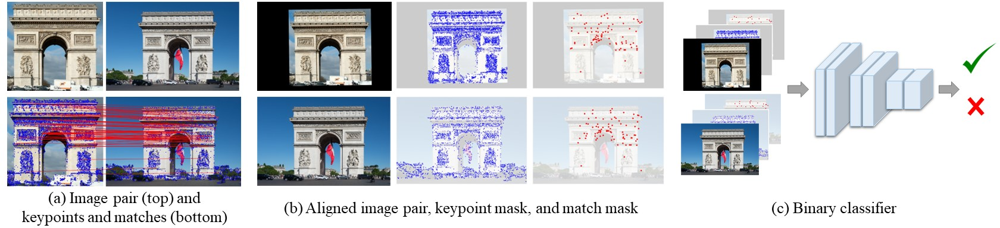

# Doppelgangers: Learning to Disambiguate Images of Similar Structures

[Ruojin Cai](https://www.cs.cornell.edu/~ruojin/)<sup>1</sup>, 
[Joseph Tung](https://www.linkedin.com/in/josephtung-/)<sup>1</sup>, 
[Qianqian Wang](https://www.cs.cornell.edu/~qqw/)<sup>1</sup>, 
[Hadar Averbuch-Elor](https://www.elor.sites.tau.ac.il/)<sup>2</sup>, 
[Bharath Hariharan](https://www.cs.cornell.edu/~bharathh/)<sup>1</sup>,
[Noah Snavely](https://www.cs.cornell.edu/~snavely/)<sup>1</sup>
<br>
<sup>1</sup>Cornell University,  <sup>2</sup>Tel Aviv University
<br>
ICCV 2023 Oral

#### [Project Page](https://doppelgangers-3d.github.io/) | [Paper](https://arxiv.org/pdf/2309.02420.pdf) | [Arxiv](https://arxiv.org/abs/2309.02420) | [Dataset](https://github.com/RuojinCai/doppelgangers/blob/main/data/doppelgangers_dataset/README.md)

<p float="left">
    
</p>

Implementation for paper "Doppelgangers: Learning to Disambiguate Images of Similar Structures", which proposes a learning-based approach to disambiguate distinct yet visually similar image pairs (doppelgangers) and applies it to structure-from-motion disambiguation.

## Dependencies
1. Create Conda environment with Python 3.8, PyTorch 1.12.0, and CUDA 10.2 using the following commands:
  ```bash
  conda env create -f ./environment.yml
  conda activate doppelgangers
  ```

2. Download Colmap from their [installation page](https://colmap.github.io/install.html) (version 3.8+).

## Pretrained Model 

- Pretrained model is available in the following [link](https://doppelgangers.cs.cornell.edu/dataset/checkpoint.tar.gz).
To use the pretrained models, download the `checkpoint.tar.gz` file, unzip and put `doppelgangers_classifier_loftr.pt` under `./weights/` folder.
  <details>
  <summary>[Click to expand]</summary>

  ```bash
  cd weights/
  wget -c https://doppelgangers.cs.cornell.edu/dataset/checkpoint.tar.gz
  tar -xf checkpoint.tar.gz
  mv doppelgangers/checkpoints/doppelgangers_classifier_loftr.pt ./
  rm checkpoint.tar.gz
  rm -r doppelgangers/
  ```
  </details>

- We use [LoFTR](https://github.com/zju3dv/LoFTR) models for feature matching. Please download the LoFTR outdoor checkpoint `outdoor_ds.ckpt` in the following Google Drive [link](https://drive.google.com/file/d/1M-VD35-qdB5Iw-AtbDBCKC7hPolFW9UY/view?usp=drive_link), and put it under `./weights/` folder.

## Dataset
This section contains download links for several helpful datasets:
- **SfM Disambiguation**: Download the *Structure from Motion disambigaution Dataset* from the [SfM disambiguation with COLMAP](https://github.com/cvg/sfm-disambiguation-colmap/tree/main#datasets) GitHub repository. Unzip the file under folder `./data/sfm_disambiguation/`.
- **Pairwise Visual Disambiguation**: Download the *Doppelgangers Dataset* by following [these instructions](https://github.com/RuojinCai/doppelgangers/blob/main/data/doppelgangers_dataset/README.md) and put the dataset under folder `./data/doppelgangers_dataset/`.

## SfM Disambiguation

#### Overview of applying Doppelgangers classifier to SfM disambiguation with COLMAP
- We begin by performing COLMAP feature extraction and matching, which generates a list of image pairs.
- Next, we run Doppelgangers classifiers on these image pairs, with LoFTR matches as input.
- We then remove image pairs from the COLMAP database if they have a predicted probability below the specified threshold. These pairs are more likely to be Doppelgangers.
- Finally, we perform COLMAP reconstruction with the pruned database.

#### Demo
We provide a demo on the Cup dataset to demonstrate how to use our Doppelgangers classifier in Structure from Motion disambiguation with COLMAP: `./notebook/demo_sfm_disambiguation.ipynb`.

#### Script
We provide a script for SfM disambiguation. The COLMAP reconstruction with Doppelgangers classifier can be found at `[output_path]/sparse_doppelgangers_[threshold]/`.

```bash
# Usage:
# python script_sfm_disambiguation.py [path/to/example_config] --input_image_path [path/to/dataset] --output_path [path/to/output]
python script_sfm_disambiguation.py doppelgangers/configs/test_configs/sfm_disambiguation_example.yaml \
  --colmap_exe_command colmap \
  --input_image_path data/sfm_disambiguation/yan2017/cup/images \
  --output_path results/cup/ \
  --threshold 0.8 \
  --pretrained weights/doppelgangers_classifier_loftr.pt
```

<details>
  <summary>Details of the Arguments: [Click to expand]</summary>

- To apply the Doppelgangers classifier on custom datasets, change the argument `--input_image_path [path/to/dataset]` to the dataset path accordingly, 
and set the path for output results using the argument `--output_path [path/to/output]`.
- If you have already completed COLMAP feature extraction and matching stage, you can skip this stage with the `--skip_feature_matching` argument, and specify the path to `database.db` file using the argument `--database_path [path/to/database.db]`.
  <details>
  <summary>Example [Click to expand]</summary>

  ```bash
  python script_sfm_disambiguation.py doppelgangers/configs/test_configs/sfm_disambiguation_example.yaml \
    --colmap_exe_command colmap \
    --input_image_path data/sfm_disambiguation/yan2017/cup/images \
    --output_path results/cup/ \
    --skip_feature_matching \
    --database_path results/cup/database.db
  ```
  </details>

- Use the argument `--skip_reconstruction` to skip the standard COLMAP reconstruction w/o Doppelgangers classifier.
- Change doppelgangers threshold with argument `--threshold` and specify a value between 0 and 1. A smaller threshold includes more pairs, while a larger threshold filters out more pairs. The default threshold is set to 0.8. When the reconstruction is split into several components, consider using a smaller threshold. If the reconstruction is not completely disambiguated, consider using a larger threshold.
- Pretrained model can be specified by the argument `--pretrained [path/to/checkpoint]`. 
</details>

#### Reconstruction Results
[COLMAP](https://colmap.github.io/) reconstructions of test scenes with and without the Doppelgangers classifier, as described in the paper: [reconstructions.tar.gz](https://doppelgangers.cs.cornell.edu/dataset/reconstructions.tar.gz) (3G)

These reconstructions can be imported and visualized in the COLMAP [GUI](https://colmap.github.io/gui.html).

## Pairwise Visual Disambiguation

### Method overview



(a) Given a pair of images, we extract keypoints and matches via feature matching methods. Note that this is
a negative (doppelganger) pair picturing opposite sides of the Arc de Triomphe. The feature matches are primarily in the top part of the
structure, where there are repeated elements, as opposed to the sculptures on the bottom part. 
(b) We create binary masks of keypoints and matches. We then align the image pair and masks with an affine transformation estimated from matches. 
(c) Our classifier takes the
concatenation of the images and binary masks as input and outputs the probability that the given pair is positive.

### Testing the pretrained model
```bash
# Usage:
# python test.py [path/to/config] --pretrained [path/to/checkpoint]
python test.py doppelgangers/configs/training_configs/doppelgangers_classifier_noflip.yaml \
  --pretrained weights/doppelgangers_classifier_loftr.pt
```

### Training
```bash
# Usage:
# python train.py [path/to/config] 
# python train_multi_gpu.py [path/to/config]
python train.py doppelgangers/configs/training_configs/doppelgangers_classifier_noflip.yaml

# training with multiple gpus on Doppelgangers dataset with image flip augmentation
python train_multi_gpu.py doppelgangers/configs/training_configs/doppelgangers_classifier_flip.yaml
```

## Citation
```
@inproceedings{cai2023doppelgangers,
  title     = {Doppelgangers: Learning to Disambiguate Images of Similar Structures},
  author    = {Cai, Ruojin and Tung, Joseph and Wang, Qianqian and Averbuch-Elor, Hadar and Hariharan, Bharath and Snavely, Noah},
  journal   = {ICCV},
  year      = {2023}
}
```
